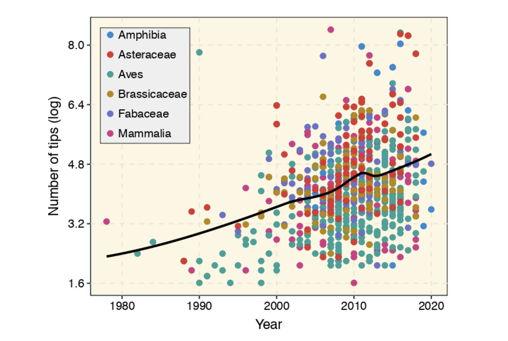

```{r setup, include=FALSE}
knitr::opts_chunk$set(echo = TRUE, eval=FALSE)
```
**Summary**

1.  The number of tips in phylogenetic trees has significantly increased
     over the last decade. This trend reflects recent advances in
     next-generation sequencing, accessibility of public data
     repositories, and the increasing use of phylogenies in many
     fields.

2.  Despite R being central to the analysis of phylogenetic data,
     manipulation of phylogenetic comparative datasets remains slow,
     complex, and poorly reproducible.

3.  Here we describe the first R package extending the functionality,
     syntax, and speed of data.table to explicitly deal with
     phylogenetic comparative datasets.

4.  treedata.table significantly increases speed and reproducibility
     during the data manipulation steps involved in the basic
     phylogenetic comparative workflow in R.

**Key-words:** character matrix, comparative methods, evolution,
phylogenetics

**Introduction**

The number and size of published phylogenetic trees have exponentially
increased over the years (Fig. 1; e.g. Smith *et al.* 2011; FitzJohn *et
al.* 2014; Smith & Brown 2019). Ongoing biodiversity sequencing efforts
have triggered the development of phylogenetic computational methods
able to deal with datasets involving hundreds of thousands of taxa
(McMahon *et al.* 2015). For instance, the early development of MAFFT
(Katoh 2002) significantly decreased CPU times required to perform
sequence alignment on molecular datasets with thousands of species.
Similarly, RAxML (Stamatakis 2006), PATHd8 (Tamura *et al.* 2012), and
TreePL (Smith & O'Meara 2012) greatly reduced computational times during
the inference and absolute dating of phylogenetic trees involving
thousands of species. Given the unprecedented pace at which phylogenetic
data is accumulating (Piel *et al.* 2000; Redelings & Holder 2017),
updating the current phylogenetic workflow to cope with the increasing
size of phylogenetic trees is now more critical than ever. Attention
should be paid to the development of faster, computationally efficient,
and more user-friendly implementations in R that further increase
reproducibility. This language is now central to research utilizing
phylogenetic comparative methods, and many essential packages and
educational materials are made available using this language (Harmon
2019).

**A short description of data.table**

treedata.table heavily relies on data.table, an R package that enables
high-performance extended functionality for data tables (Dowle and
Srinivasan 2020). data.table is not only faster than other packages
implemented in R, but also is significantly more efficient than tools in
other languages such as Python and Julia
([[https://h2oai.github.io/db-benchmark/]{.underline}](https://h2oai.github.io/db-benchmark/)).
In addition to speed, data.table has a syntactic structure that is clear
and simple to follow. Only three elements are basic to data.table's
primary function: *DT\[i, j, by\]*. First, the *i* section is used to
specify the rows to be considered in filtering or subsetting operations.
Second, the *j* section indicates the changes happening in the columns
(e.g. adding new ones, changing existing ones). Third, the *by* section
is used to perform operations based on grouping variables. A brief but
more exhaustive introduction to data.table can be found in the
data.table's vignette and wiki.

**The treedata.table workflow**

treedata.table is a wrapper for data.table for phylogenetic analyses
that matches a phylogeny to the data.table (Table 1). After an initial
tree/data matching step, treedata.table continuously preserves the
tree/data matching across data.table operations. treedata.table also
allows users to run functions from other phylogenetic packages on the
processed treedata.table objects. Below, we briefly explain the general
workflow under treedata.table.

1)  **Tree and character matrix matching:** Using the treedata.table
     package begins with creating a treedata.table object.
     as.treedata.table function matches the tip.labels of the phylogeny
     to a column of names in the data.frame.

2)  **treedata.table operations:** two main functions allow users to
     make changes to treedata.table objects. Changes are reciprocal
     between trees and data.

<!-- -->

A)  **Explicitly dropping taxa:** Taxa in treedata.table objects can be
     dropped using the droptreedata.table function. Dropped taxa
     results are removed from the character matrix and trees.

B)  **Data operations:** The most powerful functionality of
     treedata.table is related to functions calling data.table. The `[`
     function, taking the same arguments as the analog function in
     data.table, can be used to subset rows, select, and/or compute
     statistics on columns in the character matrix of the
     treedata.table object (*DT[i, j, by]*). Operations changing the
     number of rows in the character matrix will also affect the
     corresponding taxa in the tree.

3)  **Data extraction from treedata.table objects:** Users can
     independently extract trees and character matrices from
     treedata.table objects using the pulltreedata.table function. The
     `$` operator is also a valid alternative to pulltreedata.table. Two
     additional functions (`[[` and `extractVectors`) can be used to
     extract named vectors from treedata.table objects. These
     operations streamline formatting of data into the various
     different input requirements of R functions from other
     phylogenetics packages.

4)  **Using external functions in treedata.table objects:** the tdt
     function enables users to easily run external functions on
     treedata.table objects directly. Specifically, tdt passes data and
     tree attributes from a given treedata.table object as arguments to
     functions implemented in other packages.

5)  **Additional functions**: treedata.tree includes additional
     functions to detect and filter character matrixes by character
     types (continuous or discrete; detectCharacterType,
     detectAllCharacters, and filterMatrix). Other functions can be
     used to examine (head, tail, print) and describe (summary) objects
     of class treedata.table. Finally, two additional functions can be
     used to inspect and force column and row names in character
     matrices (hasNames, forceNames).

**Using treedata.table **

This brief step-by-step tutorial is based on treeplyr's *Anolis* example
data, including 100 tips and 11 characters:
```{r}

library(treedata.table)

data(anolis)
```
To use all the functionalities in treedata.table, we first construct a
treedata.table object using the as.treedata.table function, which
performs an exact name match between the tip labels of the tree and the
column in the dataset with the most matches.
```{r}

td <- as.treedata.table(tree = anolis$phy, data = anolis$dat)
```

The resulting object can be inspected using the summary(), head(),
tail(), and print() functions. For instance, we can see a description of
the treedata.tree object using the summary() function:

summary(td)

Next, we can perform data manipulation steps on the resulting
treedata.table object. For instance, we can extract the SVL column
(snout-vent length) using the following line:
```{r}

td$dat[,'SVL']
```
A named vector of the same trait (SVL) can also be extracted using
`td[["SVL"]]` or `extractVector(td, 'SVL')`. However, extractVector
further supports extraction of multiple traits. For instance, the
following code will extract two named vectors: one for SVL and another
for ecomorph.
```{r}

extractVector(td, 'SVL', 'ecomorph')
```

The real power in treedata.table is in co-indexing the tree and table
based on functions from data.table. We can use data.table syntax to
subset the treedata.table object and include only the first
representative from each ecomorph in the *Anolis* dataset.
```{r}

td[, head(.SD, 1), by = "ecomorph"]
```
We can also subset the *Anolis* dataset to include a single species per
ecomorph and island:
```{r}

td[, head(.SD, 1), by = .(ecomorph, island)]
```
Furthermore, can create a new variable summarizing SVL+hostility for
only Cuban anoles.
```{r}

td[island == "Cuba", .(Index = SVL + hostility)]
```
While the options for data manipulations are infinite, the matching
between the tree and data attributes is always constant. Finally, users
can pass data and trees in treedata.table objects as arguments to
functions in other packages. For instance, below we use the tdt function
in treedata.table to fit a continuous model of trait evolution for SVL
in geiger:

tdt(td, fitContinuous(phy, extractVector(td, 'SVL'), model="BM"))

All the functions explained above can even handle multiple trees. For
instance, below we fit the same model of continuous trait evolution on
SVL based on a multiPhylo tree for the *Anolis* dataset:
```{r}

trees <-list(anolis$phy,anolis$phy)

class(trees) <- "multiPhylo"

td <- as.treedata.table(tree=trees, data=anolis$dat)

tdt(td, fitContinuous(phy, extractVector(td, 'SVL'), model="BM"))
```
The vignette to treedata.table contains further information on the
functions outlined above and in Table 1.

**Computational performance**

***Alternatives to treedata.table.*** To our knowledge, only treeplyr
(Uyeda & Harmon 2020) performs simultaneous operations on combined
tree/data objects in R. treeplyr is largely based on dplyr (Wickham *et
al.* 2019)*.* However, keeping trees and data objects separated in the R
environment is a more standard practice. Changes to trees and data are
typically performed independently using a combination of functions
implemented in ape (Paradis & Schliep 2019), base (R Development Core
Team 2013), data.table (Dowle & Srinivasan 2019), or in the tidyverse
(Wickham et al. 2019).

***Methods.*** We used the microbenchmark (Mersman 2019) function under
default parameters to compare the performance of functions in
treedata.table to other packages. First, we compared the performance in
the initial tree/data matching step between treedata.table and treeplyr
(treedata.table::as.treedata.table() and treeplyr::make.treedata()). We
simulated trees with 10, 40, and 100 tips using rtree function in ape
(Paradis & Schliep 2019). Additionally, we generated random character
matrices (50 discrete and 50 continuous traits) matching 90% of tips in
the tree. Second, we compared the performance of data operations in
treedata.table relative to data.table (Dowle & Srinivasan 2019), base (R
Development Core Team 2013), treeplyr (Uyeda 2020), and dplyr (Wickham
*et al.* 2019). This time, we simulated trees with 1000, 10000, and
500000 tips using the rtree function in ape. Again, we generated random
character matrices (50 discrete and 50 continuous traits) matching 90%
of tips in simulated trees. We compared the performance of
treedata.table::[, data.table::[ treeplyr::%>%, dplyr::%>%, and the
equivalent functions in base when (1) subsampling the full dataset for
rows matching a single level in one discrete character, and (2)
estimating the sum and mean of two continuous traits based on the groups
of a second discrete character. In data.table syntax for this process
would be:

```{r}
td$dat[Disc1 == "A", .(sum(Cont2), mean(Cont3)), by = Disc10]
```

***Results.*** treedata.table was \>400% faster than treeplyr during the
initial data/tree matching step (Fig. 2). For instance, combining a
dataset with 10 tips to a character matrix of 40 traits (10% of
unmatched tips), as.treedata.table takes an average of 12.314 ns
(range=8.100--27.479 ns) relative to the 64.198 ns that were needed in
treeplyr (range=48.407--166.328 ns). Differences in the performance
between these two functions also scale with the number of taxa.

Next, we examined the performance of data operations in treedata.table
relative to data.table, base, treeplyr, and dplyr (Fig. 3). We found
that the simultaneous processing of phylogenetic trees in
treedata.table\'s compromised the speed of our package by 90% relative
to relative to data.table. However, data manipulation in treedata.table
(which simultaneously processes phylogenies) is still significantly
faster than in other commonly used packages for data manipulation only
such as base (\>35%), treeplyr (\>60%), and dplyr (\>90%). The higher
performance of treedata.table relative to other functions also increases
with the size of the dataset.

**Current limitations of treedata.table**

The current release of treedata.table can handle phylo and multiPhylo
objects. A single character matrix is shared across all the trees in the
treedata.table object. Additionally, all the trees and the only
character matrix in the same treedata.table object are forced to have
the same tip-level sampling. We acknowledge that partial tree/data
matching is desirable in some situations. For instance, users may be
interested in performing analyses on trees that, despite having
different tip-level sampling, partially overlap with a common character
matrix. Similarly, users may be interested in using multiple character
matrices instead of only one. Future releases of the treedata.table
package will focus on relaxing some restrictions on the tree/data
matching.

**Conclusions**

Here we describe the first R package that extends the functionality,
syntax, and speed of data.table for performing operations in
phylogenetic comparative datasets. treedata.table is expected to
increase code reproducibility while simplifying the complexity of
scripts. Finally, data manipulation in treedata.table, which is
significantly faster than in other commonly used packages, will allow
researchers to fast perform data manipulation on large datasets without
requiring outstanding computational resources.

**Acknowledgments**

This package was partially developed during the "Nantucket phylogeny
developeR workshop", organized by Liam J. Revell (NSF DBI-1759940). AMW
was supported by an Institutional Development Award (IDeA) from the
National Institute of General Medical Sciences of the National
Institutes of Health under grant number P2O GM103424-18.The authors
thank Hugo Gruson, Kari Norman, and Julia Gustavsen for helpful comments
during review in rOpenSci. Heidi E. Steiner revised an early version of
the manuscript and assisted with logo design.

**Authors' contributions**

A.M.W., J.C.U. conceived the project. C.R.P., A.M.W., and J.C.U.
developed the methods. C.R.P. analyzed the data and led the writing. All
co-authors assisted with edits and approved publication.

**Data accessibility**

The treedata.table package and documentation are hosted at
[[https://github.com/ropensci/treedata.table]{.underline}](https://github.com/ropensci/treedata.table/).

**References**

> Dowle, M. & Srinivasan, A. (2019). data.table: Extension of
> \`data.frame\`. R package version 1.12.6.
> [[https://CRAN.R-project.org/package=data.table]{.underline}](https://cran.r-project.org/package=data.table)
> (accessed 26 August 2020).
>
> Fitzjohn, R.G., Pennell, M.W., Zanne, A.E., Stevens, P.F., Tank, D.C.
> & Cornwell, W.K. (2014). How much of the world is woody? *Journal of
> Ecology*, **102**, 1266--1272.
>
> Harmon, L.J. 2019. Phylogenetic Comparative Methods. No commercial
> publisher.
>
> Katoh, K. (2002). MAFFT: a novel method for rapid multiple sequence
> alignment based on fast Fourier transform. *Nucleic Acids Research*,
> **30**, 3059--3066.
>
> Mcmahon, M.M., Deepak, A., Fernández-Baca, D., Boss, D. & Sanderson,
> M.J. (2015). STBase: One Million Species Trees for Comparative
> Biology. *Plos One*, **10**.
>
> Mersmann, O. (2019). microbenchmark: Accurate Timing Functions. R
> package version 1.4-7.
> [[https://CRAN.R-project.org/package=microbenchmark]{.underline}](https://cran.r-project.org/package=microbenchmark)
> (accessed 26 August 2020).

> Michonneau F., Brown J.W., & Winter D.J. (2016). rotl: an R package  > to interact with the Open Tree of Life data. *Methods in Ecology and
> Evolution*, **7**, 1476--1481.

> Paradis, E. & Schliep, K. (2018). ape 5.0: an environment for modern
> phylogenetics and evolutionary analyses in R. *Bioinformatics*,
> **35**, 526--528.
>
> Piel, W.H., Donoghue, M.J., Sanderson, M.J., & Netherlands, L. (2000).
> TreeBASE: a database of phylogenetic information. In Proceedings of
> the 2nd International Workshop of Species 2000.
>
> R Core Team (2013). R: A language and environment for statistical
> computing. R Foundation for Statistical Computing, Vienna, Austria.
> [[https://www.R-project.org/]{.underline}](https://www.r-project.org/)
> (accessed 26 August 2020).
>
> Redelings, B.D. & Holder, M.T. (2017). A supertree pipeline for
> summarizing phylogenetic and taxonomic information for millions of
> species. *PeerJ*, **5**.
>
> Smith, S.A. & Brown, J.W. (2018). Constructing a broadly inclusive
> seed plant phylogeny. *American Journal of Botany*, **105**, 302--314.
>
> Smith, S.A. & O'Meara, B.C. (2012). treePL: divergence time estimation
> using penalized likelihood for large phylogenies. *Bioinformatics*,
> **28**, 2689--2690.
>
> Smith, S.A., Beaulieu, J.M., Stamatakis, A. & Donoghue, M.J. (2011).
> Understanding angiosperm diversification using small and large
> phylogenetic trees. *American Journal of Botany*, **98**, 404--414.
>
> Stamatakis, A. (2006). RAxML-VI-HPC: maximum likelihood-based
> phylogenetic analyses with thousands of taxa and mixed models.
> *Bioinformatics*, **22**, 2688--2690.
>
> Tamura, K., Battistuzzi, F.U., Billing-Ross, P., Murillo, O.,
> Filipski, A. & Kumar, S. (2012). Estimating divergence times in large
> molecular phylogenies. *Proceedings of the National Academy of
> Sciences*, **109**, 19333--19338.
>
> Uyeda, J.C. & Harmon, L.J. (2020). treeplyr: \'dplyr\' Functionality
> for Matched Tree and Data Objects. R package version 0.1.9.
> [[https://github.com/uyedaj/treeplyr]{.underline}](https://github.com/uyedaj/treeplyr)
> (accessed 26 August 2020).
>
> Wickham, H., Averick, M. , Bryan, J., Chang, W., D\'Agostino, L.,
> François, M., François, R., Grolemund, G., Hayes, A., Henry, L.,
> Hester, J. Kuhn, M., Pedersen, T.L., Miller, E., Bache, S.M,., Müller,
> K., Ooms, J., Robinson, D., Seidel, D.P., Spinu, V., Takahashi, K.,
> Vaughan, D., Wilke, C.O., Woo, K., and Yutani H. (2019). Welcome to
> the tidyverse. Journal of Open Source Software, **4:**1686.
>
> Wickham, H., François, R., Henry, L. & Müller, K. (2019). dplyr: A
> Grammar of Data Manipulation. R package version 0.8.3.
> h[[ttps://CRAN.R-project.org/package=dplyr]{.underline}](https://cran.r-project.org/package=dplyr)
> (accessed 26 August 2020).

**Figures**

{width="6in" height="4in"}

**Fig. 1.** Temporal change in phylogenetic tree sizes between 1978 and
2020 based on 927 publications for different animal and plant groups. We
used a LOESS smoothing to depict the temporal trend in tree size over
time. Data was retrieved from the Open Tree of Life using the rotl R
package (Michonneau et al. 2016). A linear regression that accounted for
lineage identity indicated the significant increase in tree size over
time (R^2^=0.2077, *p\<*0.001).

{width="6in" height="3in"}

**Fig. 2.** Results for the treedata.table microbenchmark during
tree/data matching steps. Estimates of the timing during the tree/data
matching steps under treedata.table are shown in relation to treeplyr.
We show median and lower/upper quartiles times for the performance of
each package.

{width="6in" height="4in"}

**Fig. 3.** Results for the treedata.table microbenchmark during data
manipulation. We compare the performance of treedata.table against
data.table, base, treeplyr, and dplyr. We show median and lower/upper
quartiles times for the performance of each package.

**Tables**

**Table 1**. Brief descriptions of the treedata.table functions.

  Category                                Function              Description
  --------------------------------------- --------------------- ---------------------------------------------------------------------------------------------------------------------------------------------------------------------------
  treedata.table object creation          as.treedata.table     Initial step of the workflow in treedata.table. Used to match a character matrix (of class data.frame) to a single (of class phylo) or multiple trees (class multiPhylo).
  Drop taxa from treedata.table objects   droptreedata.table    Drops taxa from a treedata.table object
  Data manipulation                       \[                    Function for performing data.table operations on an object of class \'treedata.table\'
  Data extraction                         \[\[                  Function for extract a named vector from an object of class \'treedata.table\'
                                          extractVector         Returning a named vector from a treedata.table object
                                          pulltreedata.table    Returns a character matrix or tree(s) from a treedata.table object
  Run functions from other packages       tdt                   Runs a function on a \'treedata.table\' object
  Detect character type                   detectCharacterType   Function to detect whether a character is continuous or discrete
                                          detectAllCharacters   Applies detectCharacterType over an entire character matrix
                                          filterMatrix          Filter a matrix, returning either all continuous or all discrete characters
  Examine treedata.table objects          summary               Summarizing treedata.table objects
                                          print                 Print method treedata.table objects
                                          head, tail            Return the first or last part of an treedata.table object
  Inspect column/row names                hasNames              Row and column name check
                                          forceNames            Force names for rows, columns, or both
